# Architecture Class Diagram – MyDrinkShop v2.0

**Team:** DP15
**Date:** 10.03.2026
**Version:** 2.0 (revised after Lab01 inspection)

---

## Changes from v1.0

| # | Change | Reason |
|---|--------|--------|
| Removed `ProductTest` from the diagram | Test classes belong in the test source set, not the production architecture diagram | Inspection finding A05 – test class in production diagram |
| `FileAbstractRepository` constructor changed to `protected` | Prevents external instantiation of an abstract-like class | SonarQube S5993 |
| `CsvExporter` and `ReceiptGenerator` marked with `<<utility>>` | They only expose static methods; private constructors enforce non-instantiability | SonarQube S1118, inspection A07 |

---

## PlantUML Diagram (v2.0)

```plantuml
@startuml MyDrinkShop_2.0

!theme plain
top to bottom direction
skinparam linetype ortho

' ── Enumerations ──────────────────────────────────────────────
enum CategorieBautura << enumeration >> {
    ALL
    ALCOOLICA
    NEALCOOLICA
}

enum TipBautura << enumeration >> {
    ALL
    CALDA
    RECE
}

' ── Exceptions / Validators ───────────────────────────────────
class ValidationException

interface Validator<T> << interface >> {
    + validate(t: T): void
}

class OrderItemValidator {
    + validate(item: OrderItem): void
}

class OrderValidator {
    - itemValidator: OrderItemValidator
    + validate(order: Order): void
}

class ProductValidator {
    + validate(product: Product): void
}

class RetetaValidator {
    + validate(reteta: Reteta): void
}

class StocValidator {
    + validate(stoc: Stoc): void
}

' ── Repository layer ──────────────────────────────────────────
interface Repository<ID, E> << interface >> {
    + findOne(id: ID): E
    + findAll(): List<E>
    + save(entity: E): void
    + update(entity: E): void
    + delete(id: ID): void
}

abstract class AbstractRepository<ID, E> {
    # entities: Map<ID, E>
    + findOne(id: ID): E
    + findAll(): List<E>
    + save(entity: E): void
    + update(entity: E): void
    + delete(id: ID): void
}

abstract class FileAbstractRepository<ID, E> {
    # fileName: String
    # FileAbstractRepository(fileName: String)
    # loadFromFile(): void
    # saveToFile(): void
    # parseLine(line: String): E
    # toFileLine(entity: E): String
}

class FileProductRepository {
    + FileProductRepository(fileName: String)
}

class FileRetetaRepository {
    + FileRetetaRepository(fileName: String)
}

class FileOrderRepository {
    - productRepository: Repository<Integer, Product>
    + FileOrderRepository(fileName: String, productRepo: Repository)
}

class FileStocRepository {
    + FileStocRepository(fileName: String)
}

' ── Domain ────────────────────────────────────────────────────
class Product {
    - id: int
    - nume: String
    - pret: double
    - categorie: CategorieBautura
    - tip: TipBautura
}

class Reteta {
    - id: int
    - ingrediente: List<IngredientReteta>
}

class IngredientReteta {
    - denumire: String
    - cantitate: double
}

class Order {
    - id: int
    - items: List<OrderItem>
    - totalPrice: double
    + getTotalPrice(): double
    + getTotal(): double
    + computeTotalPrice(): void
}

class OrderItem {
    - product: Product
    - quantity: int
    + getTotal(): double
}

class Stoc {
    - id: int
    - ingredient: String
    - cantitate: double
    - stocMinim: double
    + isSubMinim(): boolean
}

' ── Services ──────────────────────────────────────────────────
class ProductService {
    - productRepo: Repository<Integer, Product>
    + addProduct(p: Product): void
    + updateProduct(...): void
    + deleteProduct(id: int): void
    + getAllProducts(): List<Product>
    + findById(id: int): Product
    + filterByCategorie(c: CategorieBautura): List<Product>
    + filterByTip(t: TipBautura): List<Product>
}

class RetetaService {
    - retetaRepo: Repository<Integer, Reteta>
    + addReteta(r: Reteta): void
    + getAllRetete(): List<Reteta>
}

class OrderService {
    - orderRepo: Repository<Integer, Order>
    + addOrder(o: Order): void
    + getAllOrders(): List<Order>
}

class StocService {
    - stocRepo: Repository<Integer, Stoc>
    + getAll(): List<Stoc>
    + add(s: Stoc): void
    + update(s: Stoc): void
    + delete(id: int): void
    + areSuficient(reteta: Reteta): boolean
    + consuma(reteta: Reteta): void
}

class DailyReportService {
    - repo: Repository<Integer, Order>
    + getTotalRevenue(): double
    + getTotalOrders(): int
}

class DrinkShopService {
    - productService: ProductService
    - retetaService: RetetaService
    - orderService: OrderService
    - stocService: StocService
    - report: DailyReportService
}

' ── Utilities (non-instantiable) ──────────────────────────────
class CsvExporter << utility >> {
    - CsvExporter()
    + {static} exportOrders(products, orders, path: String): void
}

class ReceiptGenerator << utility >> {
    - ReceiptGenerator()
    + {static} generate(o: Order, products: List<Product>): String
}

' ── UI ────────────────────────────────────────────────────────
class DrinkShopApp {
    + {static} main(args: String[]): void
}

class DrinkShopController {
    - service: DrinkShopService
    + setService(service: DrinkShopService): void
}

' ── Relationships ─────────────────────────────────────────────
AbstractRepository     ..|>  Repository
FileAbstractRepository --|>  AbstractRepository
FileProductRepository  --|>  FileAbstractRepository
FileRetetaRepository   --|>  FileAbstractRepository
FileOrderRepository    --|>  FileAbstractRepository
FileStocRepository     --|>  FileAbstractRepository

FileOrderRepository    "1" *-->  "productRepository\n1" Repository

OrderItemValidator     ..|>  Validator
OrderValidator         ..|>  Validator
ProductValidator       ..|>  Validator
RetetaValidator        ..|>  Validator
StocValidator          ..|>  Validator

OrderValidator         "1" *-->  "itemValidator\n1" OrderItemValidator

Product                "1" *-->  "categorie\n1" CategorieBautura
Product                "1" *-->  "tip\n1" TipBautura

Reteta                 "1" *-->  "ingrediente\n*" IngredientReteta
Order                  "1" *-->  "items\n*" OrderItem
OrderItem              "1" *-->  "product\n1" Product

ProductService         "1" *-->  "productRepo\n1" Repository
RetetaService          "1" *-->  "retetaRepo\n1" Repository
OrderService           "1" *-->  "orderRepo\n1" Repository
StocService            "1" *-->  "stocRepo\n1" Repository
DailyReportService     "1" *-->  "repo\n1" Repository

DrinkShopService       "1" *-->  "productService\n1" ProductService
DrinkShopService       "1" *-->  "retetaService\n1" RetetaService
DrinkShopService       "1" *-->  "orderService\n1" OrderService
DrinkShopService       "1" *-->  "stocService\n1" StocService
DrinkShopService       "1" *-->  "report\n1" DailyReportService

DrinkShopController    "1" *-->  "service\n1" DrinkShopService
DrinkShopController    "1" *-->  "currentOrder\n1" Order
DrinkShopController    "1" *-->  "currentOrderItems\n*" OrderItem
DrinkShopController    "1" *-->  "productList\n*" Product
DrinkShopController    "1" *-->  "retetaList\n*" Reteta
DrinkShopController    "1" *-->  "newRetetaList\n*" IngredientReteta

DrinkShopApp           ..>  DrinkShopController

@enduml
```

---

## Architecture Notes

- **Repository pattern:** All data access goes through `Repository<ID, E>`. Concrete file-based implementations extend `FileAbstractRepository`, which has a `protected` constructor (cannot be instantiated from outside the hierarchy).
- **Service layer:** Each domain concept has a dedicated service. `DrinkShopService` acts as a facade aggregating all sub-services for the controller.
- **Validator pattern:** Each domain object has a corresponding `Validator<T>` implementation that throws `ValidationException` on invalid input.
- **Utility classes:** `CsvExporter` and `ReceiptGenerator` have only static methods and private constructors — they cannot be instantiated.
- **UI layer:** `DrinkShopController` (JavaFX FXML controller) interacts only with `DrinkShopService`, keeping the UI decoupled from repositories.
- **Test classes** (`ProductTest`, etc.) are excluded from this diagram; they belong in the test source set.
